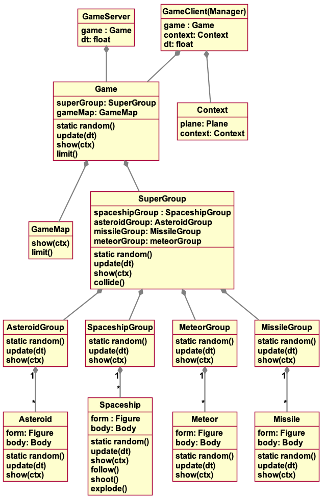
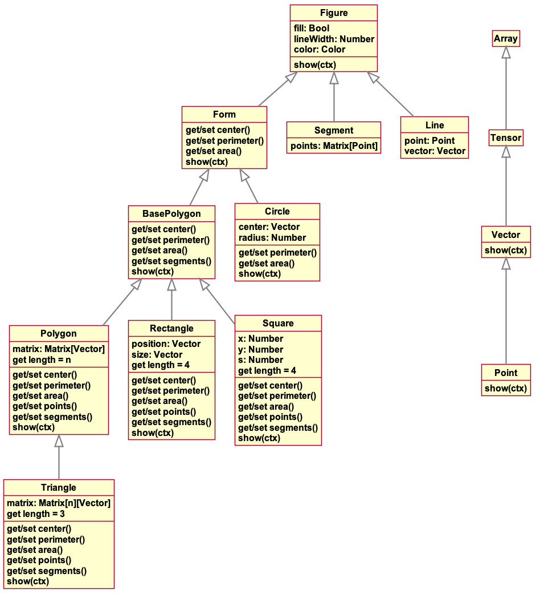
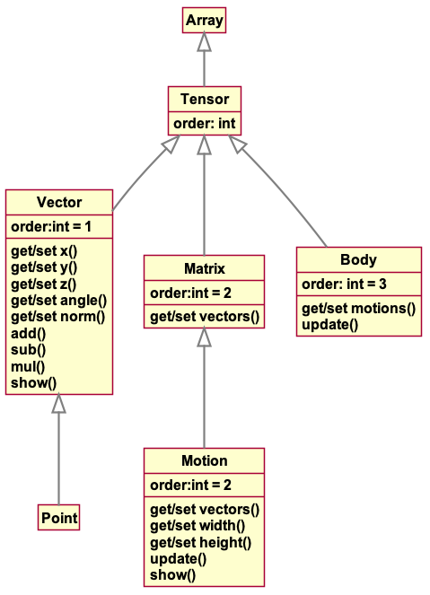

# Asteroids

## Demo


## Usage
Multiplayer web based game of space battle.

### Run
```
npm start
# or
yarn build
```

Uses port 8000 by default unless `PORT` environment variable is defined.

### Build
This project has been created using **webpack scaffold**, you can now run
```
npm run build
# or
yarn build
```
to bundle your application

## How it works?

This project is based on a custom geometrical library based on native canvas for drawing geometrical objects

### Game hierarchy 


### Geometrical hierarchy 


### Maths hierarchy 


## Credits
Made by Marc Partensky and Alexandre Bigot

## License
**MIT**
